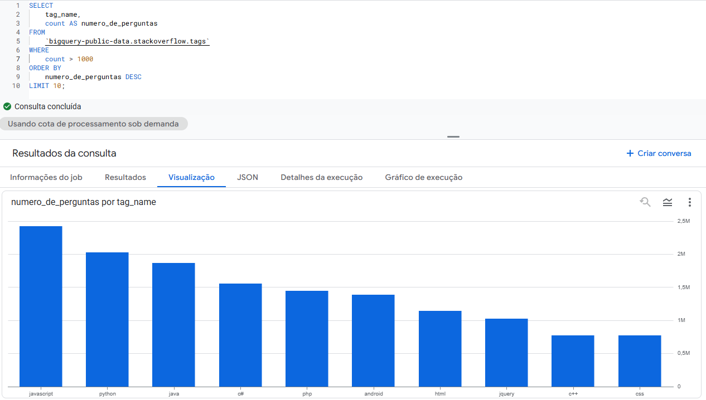

# Stack Overflow Tags Analysis

This project demonstrates data extraction and visualization using BigQuery and SQL.

## Objective

Identify the most popular technologies based on the volume of questions from the global developer community on Stack Overflow.

## Structure

- **dataset/**: Contains the `dados_tags.csv` file extracted from BigQuery.
- **sql_queries/**: Contains the `consulta_tags.sql` script used for extraction.
- **images/**: Screenshots of results and visualizations.

## Insights

As shown in the chart below, JavaScript and Python lead the volume of interactions, reflecting their dominance in the current market.

## Technologies Used
- SQL
- BigQuery
- Dataset: bigquery-public-data.stackoverflow.tags
